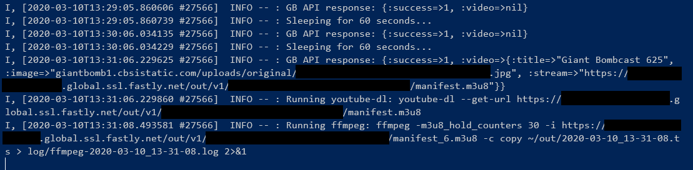

# gb-archiver

## Summary

A Ruby script to automatically download Giant Bomb livestreams that are broadcasted directly from their site.

## Details

The script runs in an infinite loop, periodically consuming the Giant Bomb API's
[current-live](https://www.giantbomb.com/api/documentation/#toc-0-55) endpoint. When a livestream is detected, the
script will run `youtube-dl` to pull out the best quality HLS stream URL, and then feed that to `ffmpeg` to download the
stream.

## Installation

The following prerequisites are required:

1. A recent, non-EOL version of Ruby
1. A functioning command/alias to [youtube-dl](https://github.com/ytdl-org/youtube-dl)
1. A nightly / recent `ffpmeg` release due to the usage of a relatively recent
   [flag for HLS streams](https://github.com/FFmpeg/FFmpeg/commit/d5e3d8e2f7a5a576e27789a50c29717b648bc488)

Once the prereq's are installed: clone the repository, and run either the binstub `bin/setup` or just a simple
`bundle install`.

## Usage

1. Copy `config/example.settings.yml` to `config/settings.yml` and provide your own settings (including GB API key). You
   can read more about what each config option does in the documentation.
1. Once configured, use the provided binstub, `bin/run`.

### What to Expect

As long as there is no livestream on the site, you shouldn't expect any changes to your filesystem. Currently, logging
is done to `stdout`. You can use simple POSIX IO redirection to save the logs to a file.

Once a livestream is detected, `ffmpeg` will be ran and have its output logged to `./log/<TIMESTAMP>.log`. The resulting
`<TIMESTAMP>.ts` file will be saved to wherever you specified in the `out_dir` config variable. "`<TIMESTAMP>`" is your
local system's time, formatted as `YYYY-MM-DD_HH-MM-SS`.

Example output when running:

## Documentation

### Config

| Config Entry       | Explanation                                    | Sample value                      |
| ------------------ | ---------------------------------------------- | --------------------------------- |
| api_key            | A valid GB API key                             | `...8fade15e29f...`               |
| api_query_interval | How often to ping the API endpoint, in seconds | 60 (recommended)                  |
| out_dir            | Where the resulting file should be stored      | `~/gb_archive/new`                |
| youtube_dl_command | A path or full command to `youtube-dl`         | `python3 ~/.local/bin/youtube-dl` |

## FAQ

- **Why does the script use `ffmpeg` separately from `youtube-dl`? Doesn't `youtube-dl` call `ffmpeg` to download
  livestreams anyway?**
  - It does, however Giant Bomb's HLS livestreams apparently are not properly terminated after the stream ends, so
    `ffmpeg` will hang until it no longer gets a response from the stream URL. In my experience, this is a _very_ long
    time. The fix for this was to call `ffmpeg` separately with the relatively new `-m3u8_hold_counters` option, which
    lets you specify how many times `ffmpeg` will refresh the m3u8 manifest for a new video segment. You can read more
    about the option in [ffmpeg's documentation](https://ffmpeg.org/ffmpeg-formats.html#hls-1).
- **Can you add feature XX or enhance feature YY?**
  - Maybe! Feel free to open an issue or pull request and let's talk about it.

## Development

After checking out the repo, run `bin/setup` to install dependencies. You can also run `bin/console` for an interactive
prompt that will allow you to experiment.

## Contributing

Bug reports and pull requests are welcome on GitHub at <https://github.com/da-moo/gb-archiver>.
